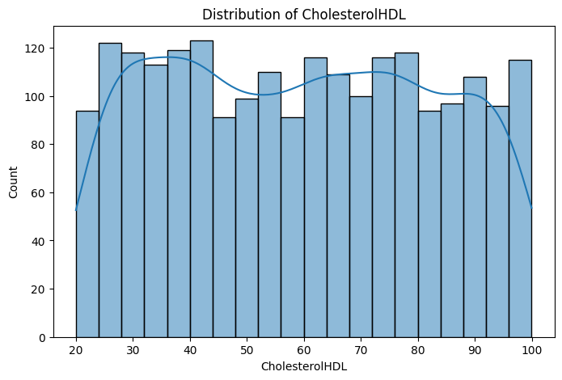

```python
import os
import re
import numpy as np
import pandas as pd
import matplotlib.pyplot as plt
import seaborn as sns
from sklearn.preprocessing import MinMaxScaler, LabelEncoder
from sklearn.model_selection import train_test_split

def split_camel_case(text):
    return re.sub(r'(?<!^)(?=[A-Z])', ' ', text)
```


```python
# Load data
data = pd.read_csv(os.path.join(".", 'alzheimers_disease_data.csv'))

data.head().T
```


<div>
<style scoped>
    .dataframe tbody tr th:only-of-type {
        vertical-align: middle;
    }

    .dataframe tbody tr th {
        vertical-align: top;
    }

    .dataframe thead th {
        text-align: right;
    }
</style>
<table border="1" class="dataframe">
  <thead>
    <tr style="text-align: right;">
      <th></th>
      <th>0</th>
      <th>1</th>
      <th>2</th>
      <th>3</th>
      <th>4</th>
    </tr>
  </thead>
  <tbody>
    <tr>
      <th>PatientID</th>
      <td>4751</td>
      <td>4752</td>
      <td>4753</td>
      <td>4754</td>
      <td>4755</td>
    </tr>
    <tr>
      <th>Age</th>
      <td>73</td>
      <td>89</td>
      <td>73</td>
      <td>74</td>
      <td>89</td>
    </tr>
    <tr>
      <th>Gender</th>
      <td>0</td>
      <td>0</td>
      <td>0</td>
      <td>1</td>
      <td>0</td>
    </tr>
    <tr>
      <th>Ethnicity</th>
      <td>0</td>
      <td>0</td>
      <td>3</td>
      <td>0</td>
      <td>0</td>
    </tr>
    <tr>
      <th>EducationLevel</th>
      <td>2</td>
      <td>0</td>
      <td>1</td>
      <td>1</td>
      <td>0</td>
    </tr>
    <tr>
      <th>BMI</th>
      <td>22.927749</td>
      <td>26.827681</td>
      <td>17.795882</td>
      <td>33.800817</td>
      <td>20.716974</td>
    </tr>
    <tr>
      <th>Smoking</th>
      <td>0</td>
      <td>0</td>
      <td>0</td>
      <td>1</td>
      <td>0</td>
    </tr>
    <tr>
      <th>AlcoholConsumption</th>
      <td>13.297218</td>
      <td>4.542524</td>
      <td>19.555085</td>
      <td>12.209266</td>
      <td>18.454356</td>
    </tr>
    <tr>
      <th>PhysicalActivity</th>
      <td>6.327112</td>
      <td>7.619885</td>
      <td>7.844988</td>
      <td>8.428001</td>
      <td>6.310461</td>
    </tr>
    <tr>
      <th>DietQuality</th>
      <td>1.347214</td>
      <td>0.518767</td>
      <td>1.826335</td>
      <td>7.435604</td>
      <td>0.795498</td>
    </tr>
    <tr>
      <th>SleepQuality</th>
      <td>9.025679</td>
      <td>7.151293</td>
      <td>9.673574</td>
      <td>8.392554</td>
      <td>5.597238</td>
    </tr>
    <tr>
      <th>FamilyHistoryAlzheimers</th>
      <td>0</td>
      <td>0</td>
      <td>1</td>
      <td>0</td>
      <td>0</td>
    </tr>
    <tr>
      <th>CardiovascularDisease</th>
      <td>0</td>
      <td>0</td>
      <td>0</td>
      <td>0</td>
      <td>0</td>
    </tr>
    <tr>
      <th>Diabetes</th>
      <td>1</td>
      <td>0</td>
      <td>0</td>
      <td>0</td>
      <td>0</td>
    </tr>
    <tr>
      <th>Depression</th>
      <td>1</td>
      <td>0</td>
      <td>0</td>
      <td>0</td>
      <td>0</td>
    </tr>
    <tr>
      <th>HeadInjury</th>
      <td>0</td>
      <td>0</td>
      <td>0</td>
      <td>0</td>
      <td>0</td>
    </tr>
    <tr>
      <th>Hypertension</th>
      <td>0</td>
      <td>0</td>
      <td>0</td>
      <td>0</td>
      <td>0</td>
    </tr>
    <tr>
      <th>SystolicBP</th>
      <td>142</td>
      <td>115</td>
      <td>99</td>
      <td>118</td>
      <td>94</td>
    </tr>
    <tr>
      <th>DiastolicBP</th>
      <td>72</td>
      <td>64</td>
      <td>116</td>
      <td>115</td>
      <td>117</td>
    </tr>
    <tr>
      <th>CholesterolTotal</th>
      <td>242.36684</td>
      <td>231.162595</td>
      <td>284.181858</td>
      <td>159.58224</td>
      <td>237.602184</td>
    </tr>
    <tr>
      <th>CholesterolLDL</th>
      <td>56.150897</td>
      <td>193.407996</td>
      <td>153.322762</td>
      <td>65.366637</td>
      <td>92.8697</td>
    </tr>
    <tr>
      <th>CholesterolHDL</th>
      <td>33.682563</td>
      <td>79.028477</td>
      <td>69.772292</td>
      <td>68.457491</td>
      <td>56.874305</td>
    </tr>
    <tr>
      <th>CholesterolTriglycerides</th>
      <td>162.189143</td>
      <td>294.630909</td>
      <td>83.638324</td>
      <td>277.577358</td>
      <td>291.19878</td>
    </tr>
    <tr>
      <th>MMSE</th>
      <td>21.463532</td>
      <td>20.613267</td>
      <td>7.356249</td>
      <td>13.991127</td>
      <td>13.517609</td>
    </tr>
    <tr>
      <th>FunctionalAssessment</th>
      <td>6.518877</td>
      <td>7.118696</td>
      <td>5.895077</td>
      <td>8.965106</td>
      <td>6.045039</td>
    </tr>
    <tr>
      <th>MemoryComplaints</th>
      <td>0</td>
      <td>0</td>
      <td>0</td>
      <td>0</td>
      <td>0</td>
    </tr>
    <tr>
      <th>BehavioralProblems</th>
      <td>0</td>
      <td>0</td>
      <td>0</td>
      <td>1</td>
      <td>0</td>
    </tr>
    <tr>
      <th>ADL</th>
      <td>1.725883</td>
      <td>2.592424</td>
      <td>7.119548</td>
      <td>6.481226</td>
      <td>0.014691</td>
    </tr>
    <tr>
      <th>Confusion</th>
      <td>0</td>
      <td>0</td>
      <td>0</td>
      <td>0</td>
      <td>0</td>
    </tr>
    <tr>
      <th>Disorientation</th>
      <td>0</td>
      <td>0</td>
      <td>1</td>
      <td>0</td>
      <td>0</td>
    </tr>
    <tr>
      <th>PersonalityChanges</th>
      <td>0</td>
      <td>0</td>
      <td>0</td>
      <td>0</td>
      <td>1</td>
    </tr>
    <tr>
      <th>DifficultyCompletingTasks</th>
      <td>1</td>
      <td>0</td>
      <td>1</td>
      <td>0</td>
      <td>1</td>
    </tr>
    <tr>
      <th>Forgetfulness</th>
      <td>0</td>
      <td>1</td>
      <td>0</td>
      <td>0</td>
      <td>0</td>
    </tr>
    <tr>
      <th>Diagnosis</th>
      <td>0</td>
      <td>0</td>
      <td>0</td>
      <td>0</td>
      <td>0</td>
    </tr>
    <tr>
      <th>DoctorInCharge</th>
      <td>XXXConfid</td>
      <td>XXXConfid</td>
      <td>XXXConfid</td>
      <td>XXXConfid</td>
      <td>XXXConfid</td>
    </tr>
  </tbody>
</table>
</div>


```python
data.info()
```

    <class 'pandas.core.frame.DataFrame'>
    RangeIndex: 2149 entries, 0 to 2148
    Data columns (total 35 columns):
     #   Column                     Non-Null Count  Dtype  
    ---  ------                     --------------  -----  
     0   PatientID                  2149 non-null   int64  
     1   Age                        2149 non-null   int64  
     2   Gender                     2149 non-null   int64  
     3   Ethnicity                  2149 non-null   int64  
     4   EducationLevel             2149 non-null   int64  
     5   BMI                        2149 non-null   float64
     6   Smoking                    2149 non-null   int64  
     7   AlcoholConsumption         2149 non-null   float64
     8   PhysicalActivity           2149 non-null   float64
     9   DietQuality                2149 non-null   float64
     10  SleepQuality               2149 non-null   float64
     11  FamilyHistoryAlzheimers    2149 non-null   int64  
     12  CardiovascularDisease      2149 non-null   int64  
     13  Diabetes                   2149 non-null   int64  
     14  Depression                 2149 non-null   int64  
     15  HeadInjury                 2149 non-null   int64  
     16  Hypertension               2149 non-null   int64  
     17  SystolicBP                 2149 non-null   int64  
     18  DiastolicBP                2149 non-null   int64  
     19  CholesterolTotal           2149 non-null   float64
     20  CholesterolLDL             2149 non-null   float64
     21  CholesterolHDL             2149 non-null   float64
     22  CholesterolTriglycerides   2149 non-null   float64
     23  MMSE                       2149 non-null   float64
     24  FunctionalAssessment       2149 non-null   float64
     25  MemoryComplaints           2149 non-null   int64  
     26  BehavioralProblems         2149 non-null   int64  
     27  ADL                        2149 non-null   float64
     28  Confusion                  2149 non-null   int64  
     29  Disorientation             2149 non-null   int64  
     30  PersonalityChanges         2149 non-null   int64  
     31  DifficultyCompletingTasks  2149 non-null   int64  
     32  Forgetfulness              2149 non-null   int64  
     33  Diagnosis                  2149 non-null   int64  
     34  DoctorInCharge             2149 non-null   object 
    dtypes: float64(12), int64(22), object(1)
    memory usage: 587.7+ KB
    


```python
data.describe().T
```


<div>
<style scoped>
    .dataframe tbody tr th:only-of-type {
        vertical-align: middle;
    }

    .dataframe tbody tr th {
        vertical-align: top;
    }

    .dataframe thead th {
        text-align: right;
    }
</style>
<table border="1" class="dataframe">
  <thead>
    <tr style="text-align: right;">
      <th></th>
      <th>count</th>
      <th>mean</th>
      <th>std</th>
      <th>min</th>
      <th>25%</th>
      <th>50%</th>
      <th>75%</th>
      <th>max</th>
    </tr>
  </thead>
  <tbody>
    <tr>
      <th>PatientID</th>
      <td>2149.0</td>
      <td>5825.000000</td>
      <td>620.507185</td>
      <td>4751.000000</td>
      <td>5288.000000</td>
      <td>5825.000000</td>
      <td>6362.000000</td>
      <td>6899.000000</td>
    </tr>
    <tr>
      <th>Age</th>
      <td>2149.0</td>
      <td>74.908795</td>
      <td>8.990221</td>
      <td>60.000000</td>
      <td>67.000000</td>
      <td>75.000000</td>
      <td>83.000000</td>
      <td>90.000000</td>
    </tr>
    <tr>
      <th>Gender</th>
      <td>2149.0</td>
      <td>0.506282</td>
      <td>0.500077</td>
      <td>0.000000</td>
      <td>0.000000</td>
      <td>1.000000</td>
      <td>1.000000</td>
      <td>1.000000</td>
    </tr>
    <tr>
      <th>Ethnicity</th>
      <td>2149.0</td>
      <td>0.697534</td>
      <td>0.996128</td>
      <td>0.000000</td>
      <td>0.000000</td>
      <td>0.000000</td>
      <td>1.000000</td>
      <td>3.000000</td>
    </tr>
    <tr>
      <th>EducationLevel</th>
      <td>2149.0</td>
      <td>1.286645</td>
      <td>0.904527</td>
      <td>0.000000</td>
      <td>1.000000</td>
      <td>1.000000</td>
      <td>2.000000</td>
      <td>3.000000</td>
    </tr>
    <tr>
      <th>BMI</th>
      <td>2149.0</td>
      <td>27.655697</td>
      <td>7.217438</td>
      <td>15.008851</td>
      <td>21.611408</td>
      <td>27.823924</td>
      <td>33.869778</td>
      <td>39.992767</td>
    </tr>
    <tr>
      <th>Smoking</th>
      <td>2149.0</td>
      <td>0.288506</td>
      <td>0.453173</td>
      <td>0.000000</td>
      <td>0.000000</td>
      <td>0.000000</td>
      <td>1.000000</td>
      <td>1.000000</td>
    </tr>
    <tr>
      <th>AlcoholConsumption</th>
      <td>2149.0</td>
      <td>10.039442</td>
      <td>5.757910</td>
      <td>0.002003</td>
      <td>5.139810</td>
      <td>9.934412</td>
      <td>15.157931</td>
      <td>19.989293</td>
    </tr>
    <tr>
      <th>PhysicalActivity</th>
      <td>2149.0</td>
      <td>4.920202</td>
      <td>2.857191</td>
      <td>0.003616</td>
      <td>2.570626</td>
      <td>4.766424</td>
      <td>7.427899</td>
      <td>9.987429</td>
    </tr>
    <tr>
      <th>DietQuality</th>
      <td>2149.0</td>
      <td>4.993138</td>
      <td>2.909055</td>
      <td>0.009385</td>
      <td>2.458455</td>
      <td>5.076087</td>
      <td>7.558625</td>
      <td>9.998346</td>
    </tr>
    <tr>
      <th>SleepQuality</th>
      <td>2149.0</td>
      <td>7.051081</td>
      <td>1.763573</td>
      <td>4.002629</td>
      <td>5.482997</td>
      <td>7.115646</td>
      <td>8.562521</td>
      <td>9.999840</td>
    </tr>
    <tr>
      <th>FamilyHistoryAlzheimers</th>
      <td>2149.0</td>
      <td>0.252210</td>
      <td>0.434382</td>
      <td>0.000000</td>
      <td>0.000000</td>
      <td>0.000000</td>
      <td>1.000000</td>
      <td>1.000000</td>
    </tr>
    <tr>
      <th>CardiovascularDisease</th>
      <td>2149.0</td>
      <td>0.144253</td>
      <td>0.351428</td>
      <td>0.000000</td>
      <td>0.000000</td>
      <td>0.000000</td>
      <td>0.000000</td>
      <td>1.000000</td>
    </tr>
    <tr>
      <th>Diabetes</th>
      <td>2149.0</td>
      <td>0.150768</td>
      <td>0.357906</td>
      <td>0.000000</td>
      <td>0.000000</td>
      <td>0.000000</td>
      <td>0.000000</td>
      <td>1.000000</td>
    </tr>
    <tr>
      <th>Depression</th>
      <td>2149.0</td>
      <td>0.200558</td>
      <td>0.400511</td>
      <td>0.000000</td>
      <td>0.000000</td>
      <td>0.000000</td>
      <td>0.000000</td>
      <td>1.000000</td>
    </tr>
    <tr>
      <th>HeadInjury</th>
      <td>2149.0</td>
      <td>0.092601</td>
      <td>0.289940</td>
      <td>0.000000</td>
      <td>0.000000</td>
      <td>0.000000</td>
      <td>0.000000</td>
      <td>1.000000</td>
    </tr>
    <tr>
      <th>Hypertension</th>
      <td>2149.0</td>
      <td>0.148906</td>
      <td>0.356079</td>
      <td>0.000000</td>
      <td>0.000000</td>
      <td>0.000000</td>
      <td>0.000000</td>
      <td>1.000000</td>
    </tr>
    <tr>
      <th>SystolicBP</th>
      <td>2149.0</td>
      <td>134.264774</td>
      <td>25.949352</td>
      <td>90.000000</td>
      <td>112.000000</td>
      <td>134.000000</td>
      <td>157.000000</td>
      <td>179.000000</td>
    </tr>
    <tr>
      <th>DiastolicBP</th>
      <td>2149.0</td>
      <td>89.847836</td>
      <td>17.592496</td>
      <td>60.000000</td>
      <td>74.000000</td>
      <td>91.000000</td>
      <td>105.000000</td>
      <td>119.000000</td>
    </tr>
    <tr>
      <th>CholesterolTotal</th>
      <td>2149.0</td>
      <td>225.197519</td>
      <td>42.542233</td>
      <td>150.093316</td>
      <td>190.252963</td>
      <td>225.086430</td>
      <td>262.031657</td>
      <td>299.993352</td>
    </tr>
    <tr>
      <th>CholesterolLDL</th>
      <td>2149.0</td>
      <td>124.335944</td>
      <td>43.366584</td>
      <td>50.230707</td>
      <td>87.195798</td>
      <td>123.342593</td>
      <td>161.733733</td>
      <td>199.965665</td>
    </tr>
    <tr>
      <th>CholesterolHDL</th>
      <td>2149.0</td>
      <td>59.463533</td>
      <td>23.139174</td>
      <td>20.003434</td>
      <td>39.095698</td>
      <td>59.768237</td>
      <td>78.939050</td>
      <td>99.980324</td>
    </tr>
    <tr>
      <th>CholesterolTriglycerides</th>
      <td>2149.0</td>
      <td>228.281496</td>
      <td>101.986721</td>
      <td>50.407194</td>
      <td>137.583222</td>
      <td>230.301983</td>
      <td>314.839046</td>
      <td>399.941862</td>
    </tr>
    <tr>
      <th>MMSE</th>
      <td>2149.0</td>
      <td>14.755132</td>
      <td>8.613151</td>
      <td>0.005312</td>
      <td>7.167602</td>
      <td>14.441660</td>
      <td>22.161028</td>
      <td>29.991381</td>
    </tr>
    <tr>
      <th>FunctionalAssessment</th>
      <td>2149.0</td>
      <td>5.080055</td>
      <td>2.892743</td>
      <td>0.000460</td>
      <td>2.566281</td>
      <td>5.094439</td>
      <td>7.546981</td>
      <td>9.996467</td>
    </tr>
    <tr>
      <th>MemoryComplaints</th>
      <td>2149.0</td>
      <td>0.208004</td>
      <td>0.405974</td>
      <td>0.000000</td>
      <td>0.000000</td>
      <td>0.000000</td>
      <td>0.000000</td>
      <td>1.000000</td>
    </tr>
    <tr>
      <th>BehavioralProblems</th>
      <td>2149.0</td>
      <td>0.156817</td>
      <td>0.363713</td>
      <td>0.000000</td>
      <td>0.000000</td>
      <td>0.000000</td>
      <td>0.000000</td>
      <td>1.000000</td>
    </tr>
    <tr>
      <th>ADL</th>
      <td>2149.0</td>
      <td>4.982958</td>
      <td>2.949775</td>
      <td>0.001288</td>
      <td>2.342836</td>
      <td>5.038973</td>
      <td>7.581490</td>
      <td>9.999747</td>
    </tr>
    <tr>
      <th>Confusion</th>
      <td>2149.0</td>
      <td>0.205212</td>
      <td>0.403950</td>
      <td>0.000000</td>
      <td>0.000000</td>
      <td>0.000000</td>
      <td>0.000000</td>
      <td>1.000000</td>
    </tr>
    <tr>
      <th>Disorientation</th>
      <td>2149.0</td>
      <td>0.158213</td>
      <td>0.365026</td>
      <td>0.000000</td>
      <td>0.000000</td>
      <td>0.000000</td>
      <td>0.000000</td>
      <td>1.000000</td>
    </tr>
    <tr>
      <th>PersonalityChanges</th>
      <td>2149.0</td>
      <td>0.150768</td>
      <td>0.357906</td>
      <td>0.000000</td>
      <td>0.000000</td>
      <td>0.000000</td>
      <td>0.000000</td>
      <td>1.000000</td>
    </tr>
    <tr>
      <th>DifficultyCompletingTasks</th>
      <td>2149.0</td>
      <td>0.158678</td>
      <td>0.365461</td>
      <td>0.000000</td>
      <td>0.000000</td>
      <td>0.000000</td>
      <td>0.000000</td>
      <td>1.000000</td>
    </tr>
    <tr>
      <th>Forgetfulness</th>
      <td>2149.0</td>
      <td>0.301536</td>
      <td>0.459032</td>
      <td>0.000000</td>
      <td>0.000000</td>
      <td>0.000000</td>
      <td>1.000000</td>
      <td>1.000000</td>
    </tr>
    <tr>
      <th>Diagnosis</th>
      <td>2149.0</td>
      <td>0.353653</td>
      <td>0.478214</td>
      <td>0.000000</td>
      <td>0.000000</td>
      <td>0.000000</td>
      <td>1.000000</td>
      <td>1.000000</td>
    </tr>
  </tbody>
</table>
</div>


```python
sum(data.duplicated())
```


    0


```python
data = data.drop(columns=['PatientID', 'DoctorInCharge'])

# Identify numerical columns: columns with more than 10 unique values are considered numerical
numerical_columns = [
    col for col in data.columns if data[col].nunique() > 10]

# Identify categorical columns: columns that are not numerical and not 'Diagnosis'
categorical_columns = data.columns.difference(
    numerical_columns).difference(['Diagnosis']).to_list()
```


```python
custom_labels = {
    'Gender': ['Male', 'Female'],
    'Ethnicity': ['Caucasian', 'African American', 'Asian', 'Other'],
    'EducationLevel': ['None', 'High School', 'Bachelor\'s', 'Higher'],
    'Smoking': ['No', 'Yes'],
    'FamilyHistoryAlzheimers': ['No', 'Yes'],
    'CardiovascularDisease': ['No', 'Yes'],
    'Diabetes': ['No', 'Yes'],
    'Depression': ['No', 'Yes'],
    'HeadInjury': ['No', 'Yes'],
    'Hypertension': ['No', 'Yes'],
    'MemoryComplaints': ['No', 'Yes'],
    'BehavioralProblems': ['No', 'Yes'],
    'Confusion': ['No', 'Yes'],
    'Disorientation': ['No', 'Yes'],
    'PersonalityChanges': ['No', 'Yes'],
    'DifficultyCompletingTasks': ['No', 'Yes'],
    'Forgetfulness': ['No', 'Yes']
}

for column in categorical_columns:
    plt.figure(figsize=(8, 5))
    sns.countplot(data=data, x=column)
    plt.title(f'Countplot of {column}')

    manager = plt.get_current_fig_manager()
    title = split_camel_case(column)
    manager.set_window_title(title)

    # Directly set custom labels
    labels = custom_labels[column]
    ticks = range(len(labels))
    plt.xticks(ticks=ticks, labels=labels)

    plt.show()
```


    

    


    

    


    

    


    

    


    

    


    

    


    

    


    

    


    

    


    

    


    

    


    

    


    

    


    

    


    

    


    

    


    

    


```python
for column in numerical_columns:
    plt.figure(figsize=(8, 5))
    sns.histplot(data=data, x=column, kde=True, bins=20)
    plt.title(f'Distribution of {column}')
    plt.show()
```


    

    


    

    


    

    


    

    


    

    


    

    


    

    


    

    


    

    


    

    


    

    


    

    


    

    


    

    


    

    


```python
mask = np.triu(np.ones_like(data.corr(), dtype=bool))

# Plot heatmap of the correlation matrix
plt.figure(figsize=(12, 10))
sns.heatmap(data.corr(),cmap="coolwarm", cbar_kws={"shrink": .5}, mask=mask)

plt.show()
```


    

    

